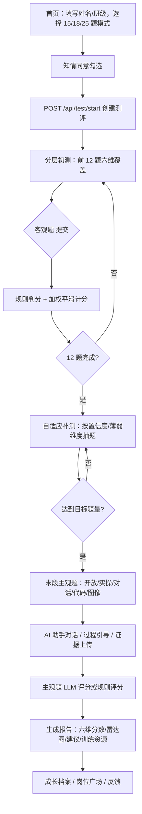
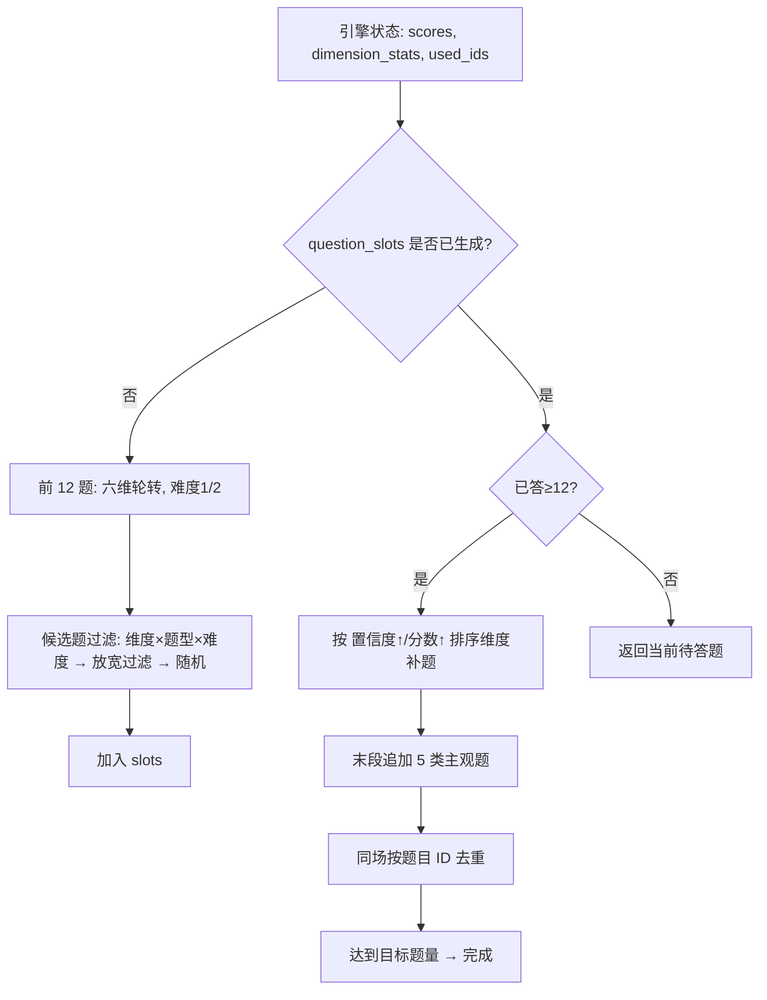
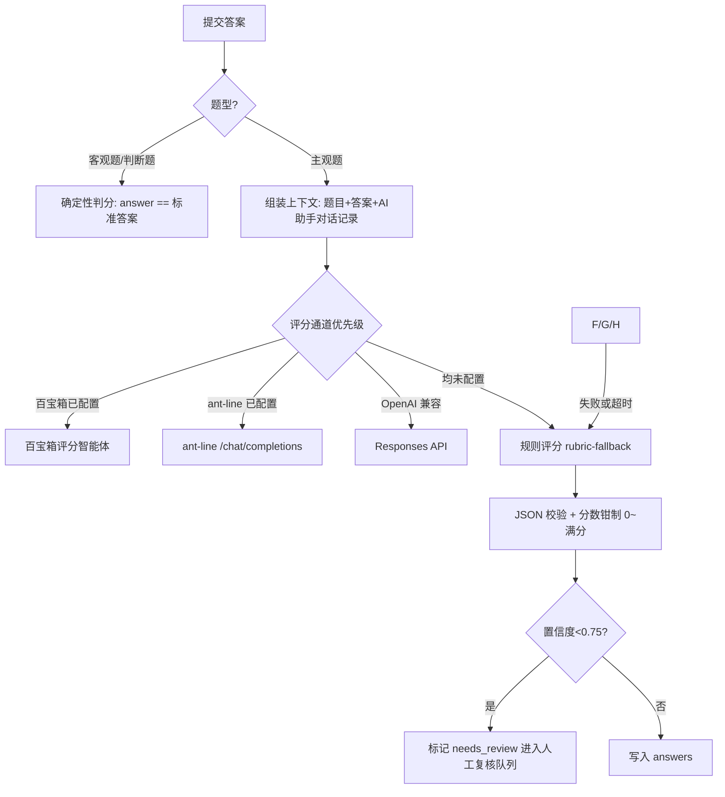
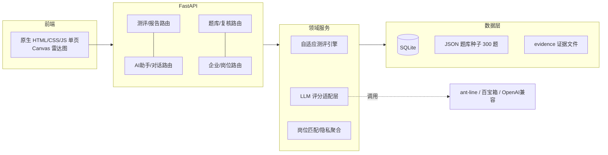

# 成员C 交付物：技术架构、核心代码、选型、流程图、题例、测试用例与 PPT 大纲

> 适用版本：AI 能力测评智能体 v1.5.0（题库 300 题 / 50 测试全绿）
> 定位：成员 C 职责范围 —— 技术架构 + 核心代码示例 + 关键技术选型说明（测评引擎设计、大模型调用方式、数据存储方案等）+ 流程图 + 题例与测试用例 + PPT 制作。

---

## 一、交付物总览

| # | 交付物 | 落点 | 对应阶段 | 截止时间 |
|---|---|---|---|---|
| 1 | 业务流程图（开始→自适应出题→实操→评分→报告） | 本文档 §二 + ProcessOn/Visio 成图 | 第一阶段 | 8.25 |
| 2 | UI 原型/线框（整理现有截图 + 关键交互线框） | `docs/UI预览_*.png` 已具备，本文档 §二.4 交互清单 | 第一阶段 | 8.25 |
| 3 | 技术架构 + 关键技术选型说明 | 本文档 §三；正式 docx 见 `提交材料/02_技术架构、核心代码与关键技术选型说明.docx` | 第二阶段 | 9.02 |
| 4 | 核心代码示例（引擎/LLM/存储） | 本文档 §四 | 第二阶段 | 9.02 |
| 5 | 各能力维度题例说明（考什么能力/难度/标准答案） | 本文档 §五 | 第二阶段 | 9.02 |
| 6 | 测试用例文档（输入/预期输出） | 本文档 §六 + `docs/功能测试流程.md` | 第二阶段 | 9.02 |
| 7 | PPT 初稿（页结构见 §七） | 按 §七 大纲制作 | 第三阶段 | 待定 |

---

## 二、业务流程流程图（第一阶段交付）

### 2.1 主流程（学员端）——mermaid 可直接导入 ProcessOn



**成图提示**：在 ProcessOn 新建流程图，按上表节点绘制；泳道建议分为"学员 / 系统 API / 评分服务"三条。

### 2.2 自适应出题引擎流程图



### 2.3 评分流程



### 2.4 UI 原型整理与交互线框（第一阶段）

已有截图（`docs/` 下，可直接放入 PPT/文档）：
- `UI预览_首页.png`：六维能力模型首页 + 测评模式选择
- `UI预览_答题页.png`：客观题作答 + 题号导航 + 主观题 AI 助手面板
- `UI预览_三角色首页.png`：学员/教师/企业三角色入口
- `UI预览_企业协作入口.png`：企业工作台与岗位模板
- `UI预览_移动端答题页.png`：H5 响应式适配

**需补充的交互线框（简单矩形框示意即可）**：
1. 报告页：顶部综合分/等级 → 中部六维雷达图 → 底部逐题解析 + 训练资源
2. 教师看板：指标卡（人数/测评数/反馈）→ 群体维度均分条形图 → 最近完成表 → 投递统计
3. 企业工作台：匿名群体画像 → 岗位模板列表 → 岗位管理（发布/关闭）

---

## 三、技术架构与关键技术选型（第二/三阶段交付）

### 3.1 架构分层



### 3.2 数据实体与存储方案

| 实体 | 表 | 关键字段 | 用途 |
|---|---|---|---|
| 用户 | `users` | id/name/class_name | 学员身份（本地 UUID） |
| 测评 | `tests` | id/user_id/status/target_questions/**state_json** | 引擎状态快照，支持刷新续答 |
| 答案 | `answers` | test_id/question_id/score/max_score/**feedback_json** | 判分结果与选项顺序回放 |
| 题库 | `question_items`/`question_versions` | data_json/enabled/**version** | 题目当前版 + 版本留痕 |
| 复核 | `human_reviews`/`review_resolutions` | answer_id/reviewer/score | 人工双评与裁决 |
| 对话/证据 | `ai_chat_turns`/`dialogue_turns`/`evidence_files` | test_id/question_id | 主观题过程证据 |
| 账号 | `accounts`/`auth_sessions` | role/**password_hash**(PBKDF2) | 教师/企业登录与 7 天令牌 |
| 岗位 | `positions`/`position_applications`/`job_templates` | template_id/match_score | 校企闭环 |

**存储方案要点**：
- SQLite 单文件 `data/assessment.db`，`PRAGMA foreign_keys=ON`，WAL 可选；适合本地演示与小规模试测
- 题库以 JSON 种子 + 数据库运行时版本双轨（种子只读，管理端改动走 `question_items`）
- 证据文件落盘 `data/evidence/<test_id>/`，数据库只存路径与 SHA256
- 引擎状态以 JSON 存入 `tests.state_json` → **刷新页面/重启服务可恢复未完成测评**

### 3.3 关键技术选型说明

| 选型 | 理由与实际用法 | 备选/演进 |
|---|---|---|
| **FastAPI** | 异步 ASGI 框架；路由用 Pydantic 模型做入参校验（如 `StartRequest.target_questions` 用 `Field(ge=15, le=25)`、`AnswerRequest.answer` 限 `min_length=1, max_length=10000`），非法输入直接 422；自带 `/docs` OpenAPI 调试页 | Flask/Django 需手写校验层 |
| **Uvicorn** | ASGI 服务器，`run.py` 一键 `uvicorn.run("backend.main:app", host="0.0.0.0", port=8000)`；无 `reload` 依赖，`--check` 参数只做导入自检 | gunicorn + uvicorn worker（多进程） |
| **SQLite** | 单文件零配置；`PRAGMA foreign_keys=ON` 保证 `human_reviews`/`review_resolutions` 随答案级联删除；`connection()` 上下文自动 `commit`；`A01_DB_PATH` 环境变量可切换测试库，单元测试不碰真实数据 | 正式部署迁移 PostgreSQL（多租户、并发写） |
| **ant-line / 百宝箱** | 开放题评分与 AI 助手走同一套降级链：百宝箱 `/api/chat` → ant-line `/chat/completions`（`response_format=json_object`）→ OpenAI 兼容 Responses API → 本地规则评分；每次远程调用 `timeout=60`，失败显式标注 `warning` 降级，不冒充模型 | 通道按需替换，适配层已隔离 |
| **PBKDF2 口令哈希** | `hashlib.pbkdf2_hmac("sha256", …, iterations=120_000)`，格式 `pbkdf2$iter$salt$digest`，无第三方依赖；会话令牌 `secrets.token_urlsafe(32)`，有效期 7 天 | 可换 bcrypt/argon2 |
| **原生前端** | 单文件 `index.html` 无构建链；Canvas 原生绘制六维雷达图（`drawRadar`，无图表库）；`localStorage` 存学员身份与未完成测评 ID，`sessionStorage` 存登录令牌 | Vue/React 需引入构建链 |
| **cloudflared** | `--no-autoupdate --protocol http2 --url http://127.0.0.1:8000` 起临时 HTTPS 隧道，供远程队友预测试；地址每次变化 | 正式提交需固定域名 + 反向代理 |
| **unittest** | 50 项用例全绿；测试用 `A01_DB_PATH` 指向隔离库，`test_auth_roles` 的岗位/账号 fixture 不会污染真实数据 | pytest（可平滑迁移） |

**选型原则**：以"9 月前交付可运行原型"为目标，全部选型满足三点——零部署成本（SQLite+原生前端+单文件）、可演进（FastAPI 接口规范、LLM 适配层隔离）、可解释（降级显式标注、评分校验可审计）。

**接口与工程细节（实际实现）**：
- **鉴权**：教学管理/企业工作台用 `X-Admin-Key`/`X-Enterprise-Key` 请求头或 `Authorization: Bearer <token>`；`require_admin` 依赖注入同时接受密钥与教师令牌。管理员密钥首次启动自动生成到 `data/admin_key.txt`，可用 `A01_ADMIN_KEY` 环境变量覆盖。
- **续答机制**：引擎状态（`scores`/`dimension_stats`/`used_ids`/`question_slots`）整体序列化进 `tests.state_json`，`get_engine()` 每次请求从快照重建引擎；刷新页面、重启服务都不丢进度。
- **选项乱序与防作弊**：前端每题用 Fisher-Yates 打乱选项，作答时把乱序随 `options_order` 上传，回看按保存顺序渲染；题库源文件答案位置 A/B/C/D 各 45 保持均衡，消除位置线索。
- **评分防冒用**：模型返回经 `_parse_json_object` 解析、`_normalize_remote_result` 钳制到 0~满分；置信度 <0.75 强制 `needs_review=True` 进入人工复核；降级结果带 `warning` 字段且 `model=rubric-fallback-v1`。
- **密钥管理**：`TBOX_TOKEN`/`ANT_LINE_API_KEY` 等只走进程环境变量或 `data/llm_config.json`，不写入代码、题库与数据库；README 明确提交前删除含真实密钥的配置文件。

---

## 四、核心代码示例（第二/三阶段交付，均取自实际代码）

### 4.1 自适应测评引擎：加权平滑计分（`algorithm/adaptive_test.py`）

```python
observed = stats["weighted_earned"] / stats["weighted_possible"]      # 加权正确率
reliability = 1 - math.exp(-stats["weighted_possible"] / 1.5)         # 证据量 → 可靠度
calibrated = 50.0 * (1 - reliability) + 100.0 * observed * reliability  # 50 分先验 → 实测平滑
self.state["scores"][dimension] = round(calibrated, 1)
```

**设计说明**：单题不会把分数瞬间拉到 0/100，前 2~3 道题以先验 50 分为主，证据足够后逐步收敛到实测水平；同时支持"置信度优先、分数次优"的自适应补测（`ranked_dimensions = sorted(DIMENSIONS, key=lambda k: (self.confidence(k), self.state["scores"][k]))`）。

### 4.2 大模型调用：三层降级评分（`llm/scorer.py`）

```python
def score(self, question, answer, context=""):
    if self.tbox_configured:      # 1. 百宝箱评分智能体
        try: return self._tbox_score(question, answer, context)
        except Exception as exc:
            result = self._rubric_score(question, answer, context)
            result["warning"] = f"百宝箱调用失败，已降级为规则评分：{type(exc).__name__}"
            return result
    if self.ant_line_configured:  # 2. ant-line OpenAI 兼容
        ...
    if self.api_key:              # 3. OpenAI 兼容 Responses API
        ...
    return self._rubric_score(question, answer, context)  # 4. 规则评分兜底
```

**设计说明**：每次远程调用失败都显式标注 `warning` 并降级，绝不把本地结果冒充模型评分；`_normalize_remote_result` 对模型返回做 JSON 解析校验、分数钳制（0~满分）、置信度<0.75 强制人工复核。

**ant-line 通道请求构造（`_ant_line_chat`）**：

```python
system = "你是 AI 能力测评中的对话助手，学员正在完成下面的对话式任务。对话是逐轮进行的：你每次只回应当前这一轮，只输出一条简短回复（100~200字），然后等待学员的下一条消息。绝对不要一次性输出多轮引导计划……"
messages = [{"role": "system", "content": system}]
messages.append({"role": "user", "content": f"任务：{question.get('question', '')}"})
for turn in history:                       # 历史回合回放，保证多轮上下文连续
    role = "user" if turn.get("role") == "user" else "assistant"
    messages.append({"role": role, "content": turn.get("message", "")})
messages.append({"role": "user", "content": message})
body = json.dumps({"model": self.ant_line_model, "messages": messages, "stream": False}, ensure_ascii=False)
```

**设计说明**：`history` 由调用方从 `ai_chat_turns` 表读回，逐条追加进 messages，不依赖服务端会话状态；系统提示明确"逐轮回复、不输出多轮引导剧本"，并在返回前经 `_single_turn_reply` 兜底截断，防止模型一次性预演多轮对话（回归测试覆盖）。

### 4.3 数据存储：连接、测试隔离与口令哈希（`backend/database.py`）

```python
def resolve_db_path() -> Path:
    # 优先级：代码显式重定向（合成仿真）> 环境变量 A01_DB_PATH（单元测试隔离）> 默认库
    if DB_PATH is not _DEFAULT_DB_PATH:
        return DB_PATH
    override = os.environ.get("A01_DB_PATH", "").strip()
    return Path(override) if override else DB_PATH

@contextmanager
def connection():
    path = resolve_db_path()
    path.parent.mkdir(parents=True, exist_ok=True)
    db = sqlite3.connect(path)
    db.row_factory = sqlite3.Row
    db.execute("PRAGMA foreign_keys = ON")
    try:
        yield db
        db.commit()
    finally:
        db.close()

def hash_password(password: str) -> str:
    salt = secrets.token_hex(16)
    iterations = 120_000
    digest = hashlib.pbkdf2_hmac("sha256", password.encode("utf-8"), bytes.fromhex(salt), iterations)
    return f"pbkdf2${iterations}${salt}${digest.hex()}"
```

**设计说明**：所有读写统一走 `with connection() as db:` 自动提交；`resolve_db_path()` 让单元测试（`A01_DB_PATH`）与合成仿真（模块级重定向）互不干扰真实库；口令用 PBKDF2-SHA256 12 万次迭代加盐哈希，无第三方依赖。

### 4.4 前端：选项随机打乱与保序回放（`frontend/index.html`）

```javascript
options = optionOrders[question.id] || (optionOrders[question.id] = shuffled(question.options));
// 提交时把当前乱序随 answer 一起上传，回看时按保存顺序渲染，避免选项错位
```

### 4.5 自适应抽题：分层随机与候选取样（`algorithm/adaptive_test.py`）

```python
def _ensure_question_slots(self):
    slots = self.state.setdefault("question_slots", [])
    excluded = set(slots)
    initial_target = min(12, self.state["target_questions"] - 2)
    while len(slots) < initial_target:              # 前 12 题：六维轮转
        index = len(slots)
        dimension = DIMENSIONS[index % len(DIMENSIONS)]
        difficulty = 1 if index < 6 else 2
        question_id = self._select_candidate(excluded, dimension, "single_choice", difficulty)
        slots.append(question_id); excluded.add(question_id)
    if len(self.state["used_ids"]) >= initial_target and len(slots) < self.state["target_questions"]:
        self._prepare_adaptive_stage(excluded)      # 12 题后按置信度补测 + 末段主观题

def _relax_filter(candidates, dimension, question_type, difficulty):
    filters = (
        lambda q: q["dimension"] == dimension and q["type"] == question_type and q["difficulty"] == difficulty,
        lambda q: q["dimension"] == dimension and q["type"] == question_type,
        lambda q: q["type"] == question_type and q["difficulty"] == difficulty,
        lambda q: q["type"] == question_type,
        lambda q: q["dimension"] == dimension,
    )
    for predicate in filters:                        # 由严到宽，保证题库不足时仍能抽到题
        pool = [q for q in candidates if predicate(q)]
        if pool:
            return pool
    return candidates
```

**设计说明**：题目槽位一次性规划（初测 + 自适应 + 末段 5 类主观题），同场按 `used_ids` 去重；候选题过滤从"维度×题型×难度"逐步放宽到"仅维度"，避免题库稀疏时报错。15 题场末段只取 3 类主观题，18/25 题场完整纳入代码/图像任务。

### 4.6 岗位匹配打分（`backend/enterprise.py`）

```python
def score_job_matches(dimension_scores, templates):
    result = []
    for template in templates:
        weights = template.get("weights", {})
        minimums = template.get("min_scores", {})
        weighted = sum(float(dimension_scores.get(key, 0)) * float(weight) for key, weight in weights.items())
        gaps, strengths = [], []
        for key, minimum in minimums.items():
            score = float(dimension_scores.get(key, 0))
            delta = round(score - float(minimum), 1)
            (strengths if delta >= 0 else gaps).append(
                {"dimension": key, "delta": delta, "score": round(score, 1), "minimum": minimum})
        penalty = min(20.0, sum(abs(item["delta"]) for item in gaps) * 0.12)   # 门槛缺口惩罚，上限 20
        match_score = round(max(0.0, min(100.0, weighted - penalty)), 1)
        result.append({...})
    return sorted(result, key=lambda item: item["match_score"], reverse=True)
```

**设计说明**：匹配分 = 加权能力分 − 门槛缺口惩罚；注释明确"仅用于学习发展建议，不构成录用/淘汰决策"；企业端只看匿名画像与匹配分，不接触原始答案。

### 4.7 前端：Canvas 雷达图（`frontend/index.html` `drawRadar`）

```javascript
function drawRadar(scores){
  const c=$('radar'),ctx=c.getContext('2d'),cx=195,cy=195,r=135,keys=Object.keys(DIMENSIONS),n=keys.length;
  for(let ring=1;ring<=5;ring++){                  // 五环网格
    ctx.beginPath();
    keys.forEach((_,i)=>{const a=-Math.PI/2+i*2*Math.PI/n;const x=cx+Math.cos(a)*r*ring/5,y=cy+Math.sin(a)*r*ring/5;i?ctx.lineTo(x,y):ctx.moveTo(x,y)});
    ctx.closePath();ctx.strokeStyle='#e1e6f0';ctx.stroke();
  }
  ctx.beginPath();                                 // 六维分数多边形
  keys.forEach((key,i)=>{const a=-Math.PI/2+i*2*Math.PI/n;const x=cx+Math.cos(a)*r*scores[key]/100,y=cy+Math.sin(a)*r*scores[key]/100;i?ctx.lineTo(x,y):ctx.moveTo(x,y)});
  ctx.closePath();ctx.fillStyle='rgba(49,87,213,.18)';ctx.fill();ctx.strokeStyle='#3157d5';ctx.lineWidth=2.5;ctx.stroke();
}
```

**设计说明**：不引入图表库，直接以 Canvas 2D 绘制五环网格与六维多边形，分数归一化到半径 0~100%；黑白打印主题下颜色自动切换。

---

## 五、各能力维度题例说明（第二阶段交付）

> 每题格式：题号 / 考查能力 / 难度与对应等级 / 标准答案或评分要点。以下每维选 2~3 道有代表性的题目（来自 300 题库）。

### 维度一：AI 基础认知（basic）

| 题号 | 题型 | 考查能力 | 难度/等级 | 标准答案/评分要点 |
|---|---|---|---|---|
| BA301 | 单选 | 大语言模型基本运作原理 | 难度1 / L2 | 按概率预测下一个文本片段 |
| TF302 | 判断 | 上下文窗口概念 | 难度1 / L2 | 正确 |
| BA307 | 单选 | RAG 与微调差异 | 难度2 / L3 | RAG 更新知识无需重新训练模型 |

### 维度二：提示词工程（prompt）

| 题号 | 题型 | 考查能力 | 难度/等级 | 标准答案/评分要点 |
|---|---|---|---|---|
| PR306 | 单选 | 思维链提示的作用 | 难度2 / L3 | 让模型更可能完成多步推理任务 |
| OP301 | 开放 | 用一句话解释幻觉 + 举例 | 难度2 / L3 | 量表：准确解释概念/具体场景/核验方法 |
| PR314 | 单选 | 提示注入防御 | 难度3 / L4 | 外部不可信内容中的指令可能劫持模型行为 |

### 维度三：AI 工具使用（tools）

| 题号 | 题型 | 考查能力 | 难度/等级 | 标准答案/评分要点 |
|---|---|---|---|---|
| TO304 | 单选 | 数据分析场景工具选择 | 难度1 / L2 | 用数据分析 AI 或生成统计脚本 |
| CD307 | 代码 | 调用 API 解析 JSON + 异常处理 | 难度2 / L3 | 量表：可运行/解析正确/异常处理/核验 |
| TO312 | 单选 | RAG 系统搭建链路 | 难度3 / L4 | 切分→嵌入→向量库→检索→拼入提示词 |

### 维度四：结果评估与优化（evaluation）

| 题号 | 题型 | 考查能力 | 难度/等级 | 标准答案/评分要点 |
|---|---|---|---|---|
| EV301 | 单选 | 统计数据核验步骤 | 难度1 / L2 | 核对来源、统计口径与数据时间 |
| EV312 | 单选 | 建立评估流程 | 难度3 / L4 | 定义指标→抽样→多评人评分→一致性分析 |
| IM310 | 图像 | 图表结论与数据矛盾识别 | 难度2 / L3 | 柱形逐季下降但标注"持续上升"→结论应为下降 |

### 维度五：人机协同（collaboration）

| 题号 | 题型 | 考查能力 | 难度/等级 | 标准答案/评分要点 |
|---|---|---|---|---|
| CO301 | 单选 | 人机协同概念 | 难度1 / L2 | AI 生成初稿、人工审核定稿 |
| DG313 | 对话 | 设计 AI 自动回复的人机协同机制 | 难度3 / L4 | 量表：AI 边界/转人工条件/转接信息/风险 |
| CO312 | 单选 | 人在回路（human-in-the-loop） | 难度3 / L4 | 关键节点保留人工审核与干预能力 |

### 维度六：伦理与合规（ethics）

| 题号 | 题型 | 考查能力 | 难度/等级 | 标准答案/评分要点 |
|---|---|---|---|---|
| ET301 | 单选 | 个人信息上传风险 | 难度1 / L2 | 泄露与用途失控，需脱敏 |
| ET310 | 单选 | 数据删除权 | 难度2 / L3 | 按约定期限与用户请求删除并留存记录 |
| IM316 | 图像 | 截图证据真伪核验 | 难度3 / L4 | 对话日期跳回矛盾，需核验元数据与多方印证 |

---

## 六、测试用例文档（第二阶段交付）

> 覆盖冒烟回归（76 项）与单元测试（50 项）；以下为核心代表性用例，完整清单见 `docs/功能测试流程.md`。

### 6.1 API 冒烟用例

| 用例 | 输入 | 预期输出 |
|---|---|---|
| TC-01 系统状态 | `GET /api/status` | 200；`status=ok`、`question_bank.total=300`、`ready=true` |
| TC-02 创建测评 | `POST /api/test/start {user_name, target_questions:15}` | 200；返回 `test_id`、`question`、`palette` |
| TC-03 客观题提交 | `POST /api/answer/submit {question_id, answer=标准答案}` | 200；`score == max_score`、`submitted_status=correct` |
| TC-04 判断题提交 | 提交判断题标准答案 | 200；正确=满分，错误=0 分 |
| TC-05 重复提交 | 同一题二次提交 | 409 Conflict |
| TC-06 主观题对话 | 对话式任务发起 AI 助手 | 200；`reply` 为单轮回复、`turns_used=1` |
| TC-07 报告生成 | 完成 18 题后 `GET /api/report/{id}` | 200；含六维分数、雷达图数据、建议、训练资源 |
| TC-08 管理端鉴权 | `GET /api/admin/dashboard`（无密钥） | 401；带 `X-Admin-Key` → 200 |
| TC-09 企业岗位闭环 | 企业发岗位→学员投递→查看投递 | 200/409（重复投递被拒）/关闭岗位后不可投递 |
| TC-10 非法输入 | 空姓名、target<15、坏 base64 证据 | 422（校验拦截） |

### 6.2 单元测试分组（50 项全绿）

| 分组 | 覆盖内容 |
|---|---|
| test_engine | 六维覆盖、同场去重、分层配额、提前停止、选项均衡（A/B/C/D 各 45） |
| test_scorer / test_ant_line | 规则评分、JSON 容错、降级标注、ant-line 请求构造 |
| test_ai_chat | 本地模拟助手、多轮剧本截断（回归）、对话 API 与日志 |
| test_auth_roles / test_enterprise | 三角色鉴权、岗位闭环、匿名阈值 |
| test_option_order | 选项乱序→提交→回看保序 |
| test_validation_api / test_level_scale | 题库校验接口、等级阈值边界 |

### 6.3 关键回归（改动后必跑）

```powershell
python -m unittest discover -s tests -v   # 50 项全绿
node --check 前端脚本段                    # JS 语法
python run.py --check                      # 应用导入 OK
```

---

## 七、PPT 制作大纲（第三阶段交付，初稿页结构）

> 建议 10~12 页，≤10 分钟演示；全程不出现学校/指导教师信息。

| 页码 | 页面 | 内容要点 |
|---|---|---|
| 1 | 封面 | 标题"AI 能力测评智能体"、口号、提交信息 |
| 2 | 问题背景 | 生成式 AI 普及 → AI 素养测评缺失（5 个痛点简表） |
| 3 | 解决方案总览 | 六维能力模型图 + 三种测评模式 + 三角色闭环 |
| 4 | 六维能力模型 | 六维定义 + L1~L5 分级（1 页图表） |
| 5 | 技术架构图 | §3.1 分层架构图（统一配色） |
| 6 | 自适应测评引擎 | 抽题/计分公式卡片 + 流程图（§2.2） |
| 7 | 大模型接入与评分 | 三层降级图 + 人工复核闭环（§2.3） |
| 8 | 数据存储与安全 | 实体表 + 隐私/脱敏要点 |
| 9 | 演示流程 | 首页→测评→AI 助手对话→报告（截图 2~3 张，取自 UI预览） |
| 10 | 数据验证 | 50 项测试全绿 + 300 题库 + 仿真双评指标（注明仿真） |
| 11 | 未来展望 | 真实试测、代码沙箱、PostgreSQL、证书衔接 |
| 12 | 结尾 | 总结三亮点 + 致谢 |

**PPT 制作检查**：图表统一配色（主色 #3157D5）、字体微软雅黑、流程图矢量可编辑、截图高清。

---

## 八、三阶段检查清单

**第一阶段（8.25 前）**
- [ ] §2.1~2.3 三张流程图在 ProcessOn/Visio 成图并导出 PNG/SVG
- [ ] §2.4 交互线框补齐（报告/教师看板/企业工作台）
- [ ] 现有 UI 截图整理进素材库

**第二阶段（9.02 前）**
- [ ] §三 技术架构与选型写入正式 docx（可复用 `提交材料/02_...docx`）
- [ ] §四 核心代码示例配注释截图或代码块
- [ ] §五 题例说明（每维 2~3 道）核对题库实际内容
- [ ] §六 测试用例文档与 `docs/功能测试流程.md` 合并
- [ ] 开始制作 PPT（按 §七 大纲搭骨架）

**第三阶段**
- [ ] 文档图表美化（配色统一、高清导出）
- [ ] PPT 初稿完成并与其他成员讨论修改
- [ ] 与成员 A（功能/材料）、成员 B（数据/验证）核对口径（题库 300、测试 50、仿真数据标注）
