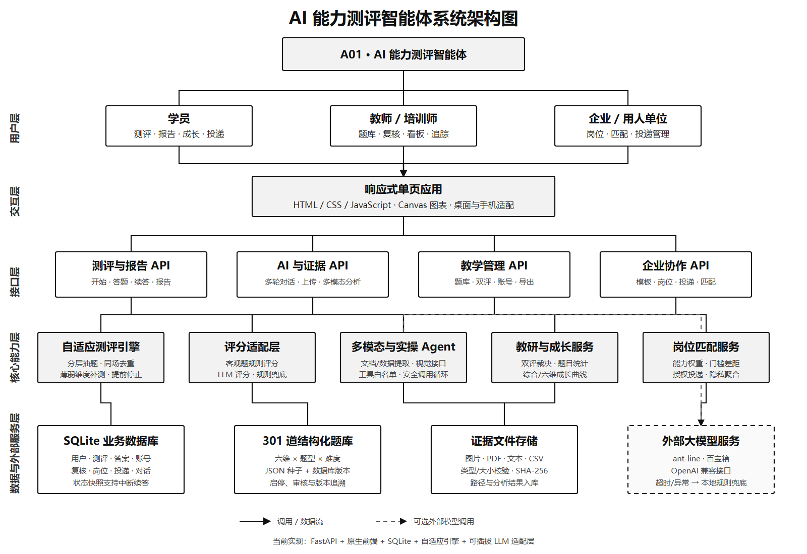

# AI 能力测评智能体：技术架构图、核心代码实例与关键技术选型说明

> 适用版本：A01 AI 能力测评智能体 v1.5.0
> 当前代码基线：`4420ba1`
> 当前题库：301 道
> 验证状态：63 项自动测试通过，49 个 Python 文件通过 AST 解析
> 文档用途：比赛提交材料、技术说明、答辩 PPT 和成员 C 技术交付

## 一、系统架构图



矢量源文件：[`系统架构图.svg`](系统架构图.svg)。SVG 可以直接插入 Word、PowerPoint、ProcessOn 或 Visio，放大后不会失真；PNG 版本适合直接提交和预览。

本架构图采用与参考图相近的自上而下树状分层结构：总系统位于顶部，依次连接用户层、交互层、接口层、核心能力层以及数据与外部服务层。图中的模块均对应当前项目已有代码，不是概念性占位。

### 1.1 用户层

- **学员**：开始测评、查看报告和成长档案、授权投递岗位。
- **教师 / 培训师**：管理题库、人工双评、数据看板、成长追踪和账号。
- **企业 / 用人单位**：管理岗位模板、发布岗位、查看授权投递和匹配解释。

### 1.2 交互层

项目使用原生 HTML、CSS、JavaScript 构建响应式单页应用，通过 Canvas 绘制雷达图和成长曲线。桌面浏览器与 390 × 844 手机视口均已完成回归。

### 1.3 接口层

FastAPI 将业务入口分成四组：

1. 测评与报告 API：开始、答题、续答、报告和成长历史；
2. AI 与证据 API：多轮对话、文件上传、多模态分析和实操 Agent；
3. 教学管理 API：题库、双评复核、账号、统计和数据导出；
4. 企业协作 API：岗位模板、岗位、授权投递和匹配结果。

### 1.4 核心能力层

- **自适应测评引擎**：按维度、题型和难度分层抽题，同场去重，向低置信度和薄弱维度补测；
- **评分适配层**：客观题确定性评分，主观题支持外部模型评分与本地规则兜底；
- **多模态与实操 Agent**：文档和数据提取、视觉模型接口、工具白名单和受控调用循环；
- **教研与成长服务**：双评、争议裁决、题目统计和综合/六维成长曲线；
- **岗位匹配服务**：能力权重、最低门槛、差距解释、授权投递和匿名聚合。

### 1.5 数据与外部服务层

- SQLite 保存用户、测评、答题、账号、复核、对话、岗位和投递记录；
- 301 道题库按“六维 × 题型 × 难度”组织，采用 JSON 种子与数据库运行版本双轨管理；
- 证据文件支持图片、PDF、文本和 CSV，上传前检查类型与大小并记录 SHA-256；
- 外部模型通道包括 ant-line、百宝箱和 OpenAI 兼容接口，异常时显式降级到本地规则。

## 二、核心代码实例

以下代码均来自当前仓库，不是为文档临时编写的伪代码。为突出关键逻辑，省略了少量类型声明和外围代码。

### 2.1 自适应抽题：六维初测、薄弱维度补测与同场去重

来源：`algorithm/adaptive_test.py:122`、`algorithm/adaptive_test.py:142`

```python
def _ensure_question_slots(self) -> None:
    slots = self.state.setdefault("question_slots", [])
    if not slots:
        slots.extend(self.state.get("used_ids", []))
        pending = self.state.get("pending_question_id")
        if pending and pending not in slots:
            slots.append(pending)

    excluded = set(slots)
    initial_target = min(12, self.state["target_questions"] - 2)
    while len(slots) < initial_target:
        index = len(slots)
        dimension = DIMENSIONS[index % len(DIMENSIONS)]
        difficulty = 1 if index < 6 else 2
        question_id = self._select_candidate(
            excluded, dimension, "single_choice", difficulty
        )
        slots.append(question_id)
        excluded.add(question_id)

    if len(self.state["used_ids"]) >= initial_target:
        self._prepare_adaptive_stage(excluded)

def _prepare_adaptive_stage(self, excluded: set[str]) -> None:
    slots = self.state["question_slots"]
    target = self.state["target_questions"]
    objective_count = target - len(TAIL_TYPES)
    ranked_dimensions = sorted(
        DIMENSIONS,
        key=lambda key: (self.confidence(key), self.state["scores"][key]),
    )
    while len(slots) < objective_count:
        dimension = ranked_dimensions[(len(slots) - 12) % len(ranked_dimensions)]
        question_id = self._select_candidate(
            excluded,
            dimension,
            "single_choice",
            self._target_difficulty(dimension),
        )
        slots.append(question_id)
        excluded.add(question_id)
```

**代码说明**：

- 前 12 题轮转覆盖六个能力维度；
- 前 6 题以难度 1 为主，后 6 题进入难度 2；
- `excluded` 与 `used_ids` 防止同一次测评出现重复题；
- 进入自适应阶段后，按“置信度低优先、得分低次优”排序维度；
- 根据当前能力分选择难度，并在末段加入开放、实操、对话、代码和图像题。

### 2.2 加权平滑计分：避免单题把能力分直接拉到 0 或 100

来源：`algorithm/adaptive_test.py:237`

```python
item_weight = 0.75 + 0.25 * float(question["difficulty"])
response_ratio = earned / max_score if max_score else 0.0
stats["weighted_earned"] += item_weight * response_ratio
stats["weighted_possible"] += item_weight

observed = stats["weighted_earned"] / stats["weighted_possible"]
reliability = 1 - math.exp(-stats["weighted_possible"] / 1.5)
calibrated = (
    50.0 * (1 - reliability)
    + 100.0 * observed * reliability
)
self.state["scores"][dimension] = round(calibrated, 1)
```

其核心公式为：

```text
维度分 = 50 × (1 - 可靠度) + 100 × 加权正确率 × 可靠度
可靠度 = 1 - exp(-加权证据量 / 1.5)
```

**代码说明**：初始能力分以 50 分作为中性先验。证据较少时不做极端判断；随着答题数量与题目难度形成的有效证据增加，结果逐渐向真实加权正确率收敛。

### 2.3 主观题模型评分：可插拔通道与透明降级

来源：`llm/scorer.py:51`

```python
def score(self, question: dict, answer: str, context: str = "") -> dict:
    if self.tbox_configured:
        try:
            return self._tbox_score(question, answer, context)
        except Exception as exc:
            result = self._rubric_score(question, answer, context)
            result["warning"] = (
                f"百宝箱调用失败，已降级为规则评分：{type(exc).__name__}"
            )
            return result

    if self.ant_line_configured:
        try:
            return self._ant_line_score(question, answer, context)
        except Exception as exc:
            result = self._rubric_score(question, answer, context)
            result["warning"] = (
                f"ant-line 调用失败，已降级为规则评分："
                f"{self._describe_error(exc)}"
            )
            return result

    if self.api_key:
        try:
            return self._remote_score(question, answer, context)
        except Exception as exc:
            result = self._rubric_score(question, answer, context)
            result["warning"] = (
                f"LLM 调用失败，已降级为规则评分：{type(exc).__name__}"
            )
            return result

    return self._rubric_score(question, answer, context)
```

**代码说明**：

- 评分层不与某一家模型平台绑定；
- 当前支持百宝箱、ant-line 和 OpenAI 兼容接口；
- 网络、配额或响应格式异常时继续完成测评；
- 降级结果带有 `warning` 和 `rubric-fallback-v1` 标识，不冒充真实模型评分；
- 模型返回结果还会经过 JSON 校验、分数范围钳制和低置信度人工复核标记。

### 2.4 多模态证据分析：真实视觉模型未配置时禁止伪装理解图片

来源：`llm/multimodal.py:97`

```python
def analyze(self, path: Path, media_type: str, question: dict) -> dict:
    suffix = path.suffix.lower()
    if suffix in {".png", ".jpg", ".jpeg", ".webp"}:
        with Image.open(path) as image:
            metadata = {
                "width": image.width,
                "height": image.height,
                "format": image.format,
                "mode": image.mode,
            }

        if not self.vision_configured:
            return {
                "status": "needs-vision-model",
                "mode": "image-metadata-only",
                "summary": (
                    "图片已安全保存并读取元数据，但尚未配置可验证的视觉模型，"
                    "未执行图像内容理解。"
                ),
                "metadata": metadata,
            }

        encoded = base64.b64encode(path.read_bytes()).decode("ascii")
        summary = self._chat(
            self.vision_base_url,
            self.vision_api_key,
            self.vision_model,
            [{"role": "user", "content": [
                {"type": "text", "text": prompt},
                {"type": "image_url", "image_url": {
                    "url": f"data:{media_type};base64,{encoded}"
                }},
            ]}],
        )
        return {"status": "analyzed", "summary": summary}
```

**代码说明**：该设计把“成功上传图片”和“模型真正理解图片”分开。视觉模型未配置时只读取图片尺寸、格式等元数据，并明确返回 `needs-vision-model`，避免把文件保存成功误写成多模态理解成功。

### 2.5 受控 AI 实操 Agent：白名单工具与调用次数限制

来源：`llm/practical_agent.py:90`

```python
def run(self, question: dict, instruction: str, evidence: list[dict]) -> dict:
    if not self.configured:
        raise RuntimeError("当前实操 Agent 未配置")

    messages = [
        {
            "role": "system",
            "content": (
                "你是受控 AI 实操助手。只可调用提供的白名单工具；"
                "禁止执行系统命令、任意代码、任意文件读取或网页访问。"
            ),
        },
        {
            "role": "user",
            "content": f"实操题：{question.get('question', '')}\n学员指令：{instruction}",
        },
    ]
    actions = []
    for _ in range(self.MAX_TOOL_CALLS + 1):
        payload = self._complete(messages)
        message = payload["choices"][0]["message"]
        calls = message.get("tool_calls") or []
        if not calls:
            return {
                "status": "completed",
                "mode": "controlled-tool-agent",
                "result": str(message.get("content") or "").strip(),
                "actions": actions,
            }
        if len(actions) + len(calls) > self.MAX_TOOL_CALLS:
            raise ValueError("模型工具调用次数超过限制")
        for call in calls:
            function = call.get("function") or {}
            arguments = json.loads(function.get("arguments") or "{}")
            output = self._execute(function.get("name", ""), arguments, evidence)
            actions.append({"tool": function.get("name"), "output": output})
```

白名单执行器中，未知工具会直接被拒绝：

```python
raise ValueError("工具不在白名单中")
```

**代码说明**：当前 Agent 只允许安全计算、证据列表和证据检查等有限工具，并限制最大调用次数。它提供了真实 function calling 的工程框架，但当前还不能等同于受控浏览器、通用代码沙箱或办公软件操作环境。

### 2.6 SQLite 连接与测试库隔离

来源：`backend/database.py:20`

```python
def resolve_db_path() -> Path:
    if DB_PATH is not _DEFAULT_DB_PATH:
        return DB_PATH
    override = os.environ.get("A01_DB_PATH", "").strip()
    return Path(override) if override else DB_PATH

@contextmanager
def connection() -> Iterator[sqlite3.Connection]:
    path = resolve_db_path()
    path.parent.mkdir(parents=True, exist_ok=True)
    db = sqlite3.connect(path)
    db.row_factory = sqlite3.Row
    db.execute("PRAGMA foreign_keys = ON")
    try:
        yield db
        db.commit()
    finally:
        db.close()
```

**代码说明**：所有数据库操作通过统一上下文管理器自动提交和关闭连接。`A01_DB_PATH` 可以把单元测试指向隔离数据库，避免测试清理真实演示库。

### 2.7 三角色权限与错误角色拦截

来源：`backend/main.py:323`

```python
def require_role(role: str):
    def dependency(authorization: str | None = Header(default=None)) -> dict:
        session = _bearer_session(authorization)
        if session is None:
            raise HTTPException(401, "请先登录")
        if session["role"] != role:
            raise HTTPException(403, "当前账号无权访问该资源")
        return session
    return dependency
```

**代码说明**：教师和企业使用 Bearer 会话令牌访问受保护接口。未登录返回 401，角色不匹配返回 403；企业端不能通过普通接口读取学员原始答案和完整个人报告。

## 三、关键技术选型

| 技术选型 | 项目中的实际用途 | 选择理由 | 后续演进 |
|---|---|---|---|
| **FastAPI** | 测评、报告、AI、题库、复核、账号、岗位等 API | Pydantic 自动校验输入；自带 OpenAPI `/docs`；适合快速构建清晰接口 | 多实例部署时配合 Gunicorn/Uvicorn Worker |
| **Uvicorn** | 运行 FastAPI ASGI 应用 | 启动简单、性能足够、便于本地和容器统一运行 | 云端增加进程管理、健康检查与监控 |
| **原生 HTML/CSS/JavaScript** | 三角色响应式单页前端 | 无 npm 构建链；仓库下载后即可运行；适合竞赛演示和快速迭代 | 业务继续扩大时迁移 Vue/React 与模块化构建 |
| **Canvas 2D** | 六维雷达图和成长曲线 | 不引入图表依赖；可精确控制展示；离线可用 | 可替换为 ECharts 以获得更多交互和无障碍能力 |
| **SQLite** | 用户、答题、复核、账号、岗位和投递持久化 | 单文件、零配置、便于打包和小规模试测 | 正式多用户云部署迁移 PostgreSQL |
| **JSON 题库 + 数据库版本表** | 301 道题库种子、运行时编辑和版本追溯 | JSON 便于审阅和协作；数据库支持启停、统计和版本管理 | 增加审核工作流、发布批次和题目生命周期管理 |
| **自研自适应引擎** | 分层抽题、置信度补测、平滑计分和提前停止 | 规则透明、便于解释和测试，符合比赛对自适应机制的要求 | 使用真实样本做 IRT/贝叶斯参数估计和阈值校准 |
| **可插拔 LLM 适配层** | 百宝箱、ant-line、OpenAI 兼容评分和对话 | 不绑定单一供应商；远程异常可透明降级；便于审计 | 增加调用追踪、成本统计、模型评测与熔断 |
| **受控 function calling** | AI 实操 Agent 的安全工具循环 | 白名单、次数限制、执行结果留痕，风险低于任意代码执行 | 接入容器代码沙箱、受控浏览器和办公工具环境 |
| **PBKDF2 + 会话令牌** | 教师和企业账号登录 | Python 标准库可实现；盐值和多次迭代避免明文密码 | 生产环境升级 Argon2、刷新令牌和细粒度 RBAC |
| **Cloudflare Tunnel / Render 配置** | 临时 HTTPS 演示与云部署准备 | 无需开放本机端口即可远程演示；Docker 配置便于迁移 | 固定域名、托管数据库、备份、日志和监控告警 |
| **unittest + 浏览器回归** | 63 项自动测试以及桌面/手机交互验证 | 标准库可直接运行；后端和真实 UI 流程均有证据 | 接入 CI，增加多浏览器、真机和性能测试 |

### 3.1 为什么当前没有直接选择微服务

项目当前是比赛演示和小规模试测系统，业务规模尚不需要多个独立部署单元。采用模块化单体可以减少部署、网络调用和分布式事务成本，同时保留清晰边界：自适应引擎、LLM 评分、多模态、企业匹配和数据库访问已经分文件组织。未来用户量和团队规模上升后，可以优先拆分模型调用服务、证据处理服务和统计服务。

### 3.2 为什么当前使用 SQLite 而不是 PostgreSQL

SQLite 适合本地演示、单机部署和快速复制数据库；无需额外账号、端口和服务进程。当前项目的主要风险不是数据库吞吐量，而是先完成可运行闭环。正式上线后，多用户并发写入、备份恢复和多实例共享会成为主要需求，此时应迁移 PostgreSQL。

### 3.3 为什么保留规则评分兜底

外部模型会受到网络、配额、响应格式和服务可用性的影响。规则兜底用于保证测评流程不中断，并为低置信度答案提供人工复核入口。兜底结果必须显示模型标识和警告，不能作为真实大模型评分准确率证据。

## 四、关键数据流

### 4.1 学员测评数据流

```text
填写信息与知情同意
    → POST /api/test/start
    → 自适应引擎生成题目槽位
    → 提交答案 / AI 对话 / 证据上传
    → 客观题规则评分或主观题模型评分
    → 状态和答案写入 SQLite
    → 生成六维报告与成长记录
    → 学员授权后进入岗位投递
```

### 4.2 人工双评数据流

```text
低置信度或抽样主观答案
    → 教师 A 独立评分
    → 教师 B 独立评分
    → 计算一致性指标
    → 分歧样本进入争议裁决
    → 保存最终分数与裁决说明
```

### 4.3 企业岗位数据流

```text
企业选择能力模板并发布岗位
    → 学员报告页展示开放岗位
    → 学员明确授权共享能力画像摘要
    → 岗位匹配服务计算加权分与门槛差距
    → 企业查看投递与解释
    → 教师查看班级投递统计
```

## 五、当前实现边界

为保证提交材料准确，以下边界需要在答辩中明确：

- 当前 100 名演示学员和 5,000 份测评均为仿真数据，不是真实学生试测；
- 24 道双评样本属于演示评分，不是两名真实教师盲评；
- 当前文档分析已配置，但视觉模型状态仍为 `not-configured`；
- 实操 Agent 已具备受控 function calling，但尚无通用代码沙箱、受控浏览器和办公工具操作环境；
- Cloudflare Quick Tunnel 只适合临时演示，不代表生产级长期云部署；
- 真实学生试测、教师 Kappa 验证、L1～L5 阈值校准和企业人员验证仍需后续完成。

## 六、交付文件

| 文件 | 用途 |
|---|---|
| `docs/系统架构图.svg` | 可编辑、可无损缩放的架构图源文件 |
| `docs/系统架构图.png` | 可直接插入 Word/PPT 的高清架构图 |
| `docs/技术架构图、核心代码实例与关键技术选型说明.md` | 完整技术说明和核心代码材料 |
