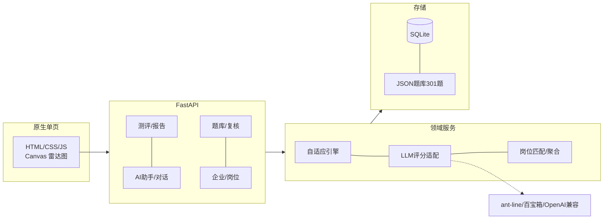
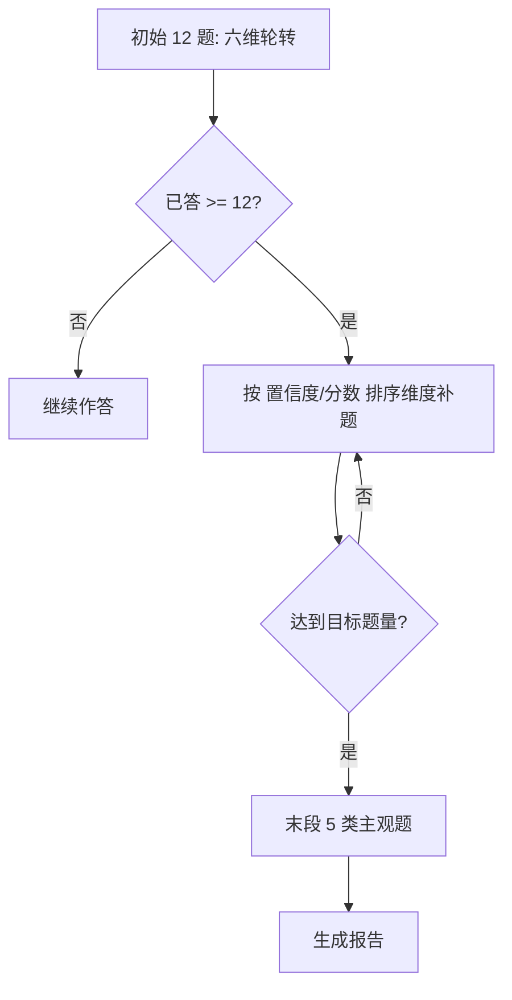
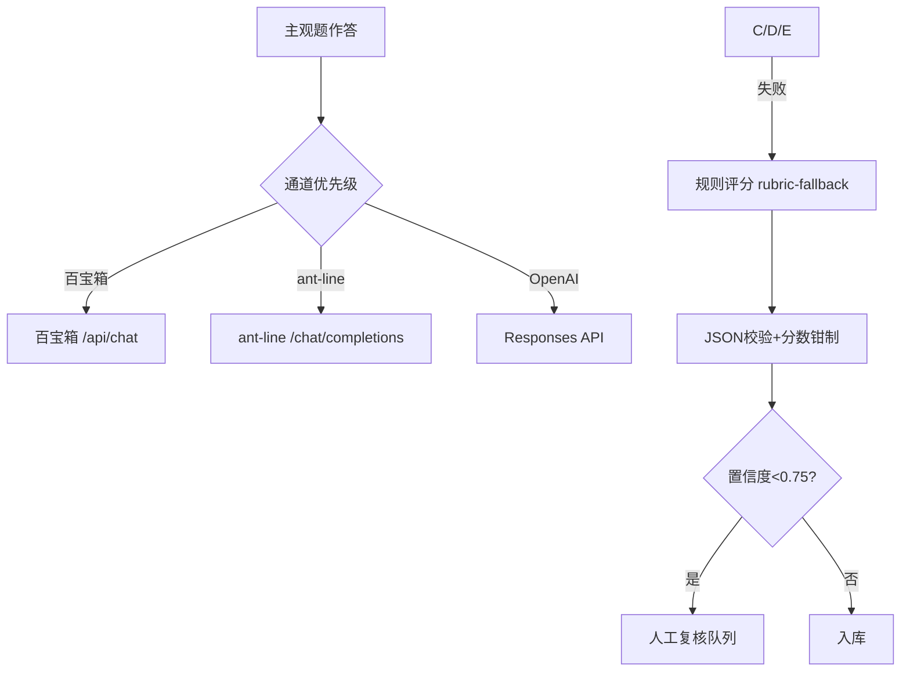

# PPT 初稿：AI 能力测评智能体（技术演示）

> 使用说明：共 12 页。每页给出【页面标题】+ 正文内容；需要图表的页面附带可直接使用的 mermaid 代码（粘贴到 mermaid.live / ProcessOn 导出图片）。
> 风格约定：白底、深蓝标题、无装饰元素；图表统一主色 #3157D5。

---

## 第 1 页　AI 能力测评智能体

- 版本 v1.5.0：题库 301 题、六维模型、63 项单元测试通过
- 内容：自适应测评引擎 + 大模型自动评分 + 报告与成长档案 + 教师/企业三角色
- 适用：高校 AI 通识课程、企业培训的技能诊断

---

## 第 2 页　要解决的问题

- 学员不清楚自己该掌握哪些 AI 能力，自评偏差大
- 传统考试无法考核人机协作、提示词工程、结果甄别这类动态技能
- 人工测评成本高，无法在班级/全校规模开展
- 教师缺少批量班级画像与成长追踪，企业缺少人才能力依据

---

## 第 3 页　六维能力模型

| 维度 | 能力描述 |
|---|---|
| AI 基础认知 | 模型原理、能力边界、上下文与幻觉 |
| 提示词工程 | 指令清晰、任务拆解、少样本、格式约束 |
| AI 工具使用 | 通用大模型、办公插件、数据分析工具选型与组合 |
| 结果评估与优化 | 事实核验、幻觉识别、评分体系与迭代 |
| 人机协同 | 分工、检查点、异常升级、人在回路 |
| 伦理与合规 | 隐私、版权、公平性、可解释性 |

- 每维 50 题（客观 30 + 开放/实操各 4 + 对话/代码/图像/判断各 3），L1~L5 行为锚定分级

---

## 第 4 页　技术架构

- 前端：原生 HTML/CSS/JS 单页，Canvas 雷达图，无构建依赖
- API 层：FastAPI，Pydantic 入参校验，OpenAPI 文档
- 领域层：自适应引擎 / LLM 评分适配 / 岗位匹配与匿名聚合
- 数据层：SQLite + JSON 题库种子 + 证据文件

---

## 第 5 页　自适应测评引擎

- 前 12 题六维轮转，难度 1/2 分层覆盖；后续按置信度、薄弱维度补测
- 计分：加权正确率 + 证据可靠度，从 50 分先验平滑收敛，单题不跳 0/100
- 同场按题目 ID 去重；末段固定 5 类主观题（开放/实操/对话/代码/图像）
- 引擎状态快照存 JSON，刷新/重启可续答

---

## 第 6 页　大模型调用与评分

- 评分通道优先级：百宝箱 → ant-line（response_format=json_object）→ OpenAI 兼容 → 本地规则
- 每次远程调用 60s 超时；失败显式标注 warning 降级，不冒充模型
- 返回 JSON 校验 + 分数钳制 0~满分；置信度 <0.75 强制进入人工复核
- AI 助手按轮次回复，历史回放保证上下文连续

---

## 第 7 页　数据存储与安全

- SQLite 单文件；外键约束、事务自动提交；`A01_DB_PATH` 支持测试库隔离
- 题库 JSON 种子 + 数据库版本留痕（修改/启停都记 `question_versions`）
- 教师/企业口令 PBKDF2 哈希（12 万次迭代），会话令牌 7 天
- 企业端只看匿名画像与匹配分，不接触原始答案；学员数据最小化收集

---

## 第 8 页　演示流程

1. 首页选择 15/18/25 题模式，开始测评
2. 客观题作答，选项随机打乱，提交即出判定
3. 主观题使用 AI 助手对话（真实模型），过程对话计入评分证据
4. 生成报告：六维雷达图、置信度、错题解析、训练资源
5. 成长档案回看历次测评，点击进入单次报告
6. 教师看板与企业岗位闭环演示

---

## 第 9 页　验证情况

- 单元测试 63 项全绿（引擎、评分、鉴权、岗位闭环、选项乱序、多模态与实操 Agent 回归）
- API 冒烟回归 76 项通过；题库结构校验 valid、每维 50 题、答案位置 A/B/C/D 各 45
- 仿真双评：100 份样本、400 条评分、模型-人工相关 0.932（合成数据，非真实用户）
- 说明：等级阈值由仿真样本校准，真实试测与教师双评待补

---

## 第 10 页　后续工作

- 真实学员试测 30 人 + 教师双评，校准等级阈值与题目难度
- 代码任务接入真实执行沙箱；图像题库替换真实对比素材
- 数据层迁移 PostgreSQL，支持多租户与更大并发
- 与 LMS/证书体系对接：能力画像标准 JSON、授权投递与申诉

---

## 第 11 页　总结

- 已完成：六维模型 + 301 题库 + 自适应引擎 + 可插拔大模型评分 + 三角色平台
- 评分通道三层降级、人工复核闭环、数据脱敏与版本留痕
- 下一步重点从功能开发转向真实验证与生态对接

---

## 第 12 页　结束

- 谢谢
- 演示环境：本地一键启动（`python run.py`），局域网/临时隧道可访问
